

<h1> Feature Selection Using LASSO, Recursive Feature Elimination, and SelectFromModel </h1>

 <p2>
 Ismael Clark, Antonela Radas, Hector Ramirez

 CAP4612-Introduction to Machine Learning

 Florida International University

 </p2>

______________________________________________

<p2>Table of Contents<p2>

______________________________________________

- [Abstract](#abstract)
- [Introduction](#introduction)
- [Feature Selection Models](#feature-selection-models)
  - [LASSO](#lasso)
  - [Recursive Feature Elimination (RFE)](#recursive-feature-elimination-rfe)
  - [SelectFromModel (SFM)](#selectfrommodel-sfm)
- [Classifiers](#classifiers)
  - [K-Nearest Neighbors (KNN)](#k-nearest-neighbors-knn)
  - [Support Vector Machine (SVM)](#support-vector-machine-svm)
  - [Random Forest (RF)](#random-forest-rf)
- [Results and Evaluation](#results-and-evaluation)
  - [Lasso](#lasso-1)
    - [t-SNE](#t-sne)
    - [Performance Matrics](#performance-matrics)
      - [K-Nearest-Neighbor](#k-nearest-neighbor)
      - [Support Vector Machine](#support-vector-machine)
      - [Random Forest](#random-forest)
    - [Confusion Matrix](#confusion-matrix)
      - [K-Nearest-Neighbor](#k-nearest-neighbor-1)
      - [Support Vector Machine](#support-vector-machine-1)
      - [Random Forest](#random-forest-1)
    - [ROC Curves](#roc-curves)
      - [K-Nearest-Neighbor](#k-nearest-neighbor-2)
      - [Support Vector Machine](#support-vector-machine-2)
      - [Random Forest](#random-forest-2)
  - [Recursive Feature Elimination (RFE)](#recursive-feature-elimination-rfe-1)
    - [t-SNE](#t-sne-1)
    - [Performance Metrics](#performance-metrics)
      - [K-Nearest-Neighbor](#k-nearest-neighbor-3)
      - [Support Vector Machine](#support-vector-machine-3)
      - [Random Forest](#random-forest-3)
    - [Confusion Matrix](#confusion-matrix-1)
      - [K-Nearest-Neighbor](#k-nearest-neighbor-4)
      - [Support Vector Machine](#support-vector-machine-4)
      - [Random Forest](#random-forest-4)
    - [ROC Curves](#roc-curves-1)
      - [K-Nearest-Neighbor](#k-nearest-neighbor-5)
      - [Support Vector Machine](#support-vector-machine-5)
      - [Random Forest](#random-forest-5)
  - [SelectFromModel](#selectfrommodel)
    - [t-SNE](#t-sne-2)
    - [Performance Metrics](#performance-metrics-1)
      - [K-Nearest-Neighbor](#k-nearest-neighbor-6)
      - [Support Vector Machine](#support-vector-machine-6)
      - [Random Forest](#random-forest-6)
    - [Confusion Matrix](#confusion-matrix-2)
      - [K-Nearest Neighbor](#k-nearest-neighbor-7)
      - [Support Vector Machine](#support-vector-machine-7)
      - [Random Forest](#random-forest-7)
    - [ROC Curves](#roc-curves-2)
      - [K-Nearest Neighbor](#k-nearest-neighbor-8)
      - [Suppport Vector Machine](#suppport-vector-machine)
      - [Random Forest](#random-forest-8)
- [Conclusion](#conclusion)
- [References](#references)

# Abstract
This paper covers the use of several supervised learning aSlgorithms in a  feature selection task on a dataset. This dataset contains normalized long non-coding RNA (lncRNA) expression profiles of 12 cancer types. Each algorithm yields a set of features which are then used by three different classifiers. To check the performance of the classification (for each set of features), the results are evaluated using different performance metrics. 

# Introduction
Feature selection is the process of selecting a subset of relevant features (variables, predictors) for use in model construction. Among the most common applications of this technique are: 
 - simplification of models to make them easier to interpret by researchers/users,
 - shorter training times,
 - to avoid the curse of dimensionality,
 - improve data's compatibility with a learning model class,
 - encode inherent symmetries present in the input space.

Data contains some features that are either redundant or irrelevant and can thus be removed without incurring much loss of information, which is the central idea in feature selection. Redundant and irrelevant are two distinct notions, since one relevant feature may be redundant in the presence of another relevant feature with which it is strongly correlated. 

Another technique that shares the general goal of reducing the number of features with feature selection, but that differs in its implementation is feature extraction. Feature extraction creates new features from functions of the original features, whereas feature selection returns a subset of the features. 

Among the different feature selection techniques figure: 

- Unsupervised Algorithms:
    - Multi-cluster feature selection (MCFS)
     - Unsupervised discriminative feature selection (UDFS)
    - Autoencoder
- Supervised Algorithms:
    - LASSO
    - SelectFromModel (python package)
    - Recursive Feature Elimination

The algorithms from the supervised learning category were used during this project.
 
# Feature Selection Models

## LASSO
Least Absolute Shrinkage and Selection Operator (Lasso)
LASSO is a regression analysis method that performs both variable selection and regularization in order to enhance the prediction accuracy and interpretability of the resulting statistical model. LASSO was originally formulated for linear regression models. However, it is easily extended to other statistical models including generalized linear models, generalized estimating equations, proportional hazards models, and M-estimators.

For its implementation, LASSO’s cost function is defined as:

<!-- $$
  {1 \over 2N_{training} } {\sum ^{N_{training}} _{i=1} (y_{real} ^{i} - y_{predict} ^i)} = \alpha {\sum _{j=1} ^{n} | \alpha _{j} |}
$$ --> 

where <!-- $\alpha _{j}$ -->  is the coefficient of the j-th feature. The final term is called l1 penalty and α is a hyperparameter that tunes the intensity of this penalty term. The higher the coefficient of a feature, the higher the value of the cost function. This model seeks to optimize the cost function reducing the value of the coefficient. The values must be scaled to achieve meaningful results. 

While implementing the model, using the LassoCV library from the sklearn.linear_model package. Also,  <!-- $a_i=i-1+0.1$ -->  | <!-- $0=0.01\space and\space i \in [0,10)$ --> . Each one of these values of alpha yielded a set of features which were stored for later analysis.

## Recursive Feature Elimination (RFE)

Recursive feature elimination is a feature selection algorithm that selects features based on how they affect the performance of a particular model. It reduces model complexity by removing features one by one until the optimal number of features is left. The algorithm can wrap around any model, and it produces the best possible set of features that gives the highest performance.

For its implementation, the RFE class  was used, taken from the sklearn.feature_selection package. Logistic Regression was used as the estimator,  as required by the class. An estimator is the model whose performance will be evaluated for a set of features returned from the algorithm. 

As specified in the project instructions, the number of feature to select <!-- $(n)$ -->   by the algorithm in each iteration is defined as 

<!-- $n_i=n_{i-1}$ --> |<!-- $n_0=20$ -->  and <!-- $i\epsilon[0,5)$ -->  

## SelectFromModel (SFM)
SelectFromModel is a python class that acts as a meta converter that selects features based on importance weights. The post-fit evaluator must have feature_importances_ or coef_ attributes. [Sources: 3, 9]. Once set up, the method needs to be adapted for the training set and with the get_support attribute the  importance of features can be controlled.
Like the RFE, SelectFromModel from Scikit-Learn is based on a Machine Learning Model estimation for selecting the features. The differences are that SelectFromModel feature selection is based on the importance attribute (often is coef_ or feature_importances_ but it could be any callable) threshold. By default, the threshold is the mean.
As specified in the project instructions, the number of feature to select <!-- $(n)$ -->  by the algorithm in each iteration is defined as

 <!-- $n_i=n_{i -1}$ -->  | <!-- $n_0=20$ -->  and <!-- $i\epsilon[0,5)$ -->  

# Classifiers 
## K-Nearest Neighbors (KNN)
A supervised learning and model classification algorithm that helps us find which class a new input belongs to when the k nearest neighbors are selected and the distance between them is calculated. KNN, also known as K-Nearest Neighbor, is a supervised learning and model classification algorithm that helps us determine which class a new input belongs to (test value) when k nearest neighbors are selected and the distance between them. The k-nearest neighbors (KNN) algorithm is a data classification technique for estimating the likelihood that a data point will become a member of a given group, based on the group to which the nearest data points belong. The k-nearest neighbors (KNN) algorithm is a simple and easy-to-implement supervised machine learning algorithm that can be used to solve classification and regression problems. 
    
Supervised machine learning (as opposed to unsupervised machine learning) relies on labeled inputs to learn a function that produces appropriate output when new untagged data is provided. The unsupervised machine learning algorithm uses untagged inputs, in other words, no teacher (shortcut) tells the child (computer) when he is right or when he made a mistake so that he can correct himself. 

## Support Vector Machine (SVM)

In its basic form, linear partitioning, the SVM tries to find a line that maximizes the separation between the dataset in two 2D spatial point classes. SVM classifies data by finding the best hyperplane that separates all data points of one class from those of another class. The best hyperplane for an SVM is the hyperplane with the largest gap between the two classes. In the SVM algorithm, we are trying to maximize the headroom between data points and hyperplane. 
The distance between the vector and the hyperplane is called the margin. The distance from the vector to the hyperplane is called the field, which is the distance between the line and the closest point in the class. The hyperplane (line) passes through the maximum field, which is the maximum distance between the data points of the two classes. Then the classification is completed by finding the hyperplane that best distinguishes the two classes. 

## Random Forest (RF)
While an estimate of the prediction accuracy is used for the importance of the permutation, in random forests this Gini admixture can be used to measure the informativeness of a function in a model. Swap importance is a measure that tracks the accuracy of a forecast in which variables are randomly swapped from over-the-counter samples. Tree-based algorithms typically use mean for continuous functions or mode for categorical functions when predicting training samples in the regions to which they belong. 
    
They can also make predictions with high accuracy, stability, and easy interpretation. Therefore, every data scientist should learn these algorithms and use them in their machine learning projects. 
       
To facilitate the systematic and standardized refinement of somatic variants based on cancer sequencing data, random forest (RF) models and a deep learning (DL) approach have been used to demonstrate that these machine learning methods can provide classification efficiency. The classes are high and the same in all refinements of the variants (Ainscough et al., 2018). A machine learning approach called Cerebro improved the accuracy of invoking verified somatic mutations in tumor samples and outperformed many other methods for detecting somatic mutations (Wood et al., 2018). The potential for CNNs to use crude nucleotide sequences to classify cancer mutations was initially explored by using tag coding, hot coding, and embedding to preprocess DNA information. 

# Results and Evaluation

## Lasso

### t-SNE

This image contains the tsne when lasso has selected 512 through 29 features. With 512 features we can see some real clear clustering and even with as low as 68 features classes seem to be very distinct. 

This image shows selected features from 21 through 12. Compared the higher number of features there is a clear disorganization in the classes as the plotting becomes more chaotic. 

Lastly, this image shows lasso with 11 and 9 features selected. In this images the classes are even more chaotic with less clustering. 

### Performance Matrics 

#### K-Nearest-Neighbor

When running KNN on the data set with the LASSO selected feature, we can see that with high number of feature selection overall accuracy, precision, recall and f1 are around 94%, with a rapid decline when the number of features falls bellow 100. 

#### Support Vector Machine

When running the same features through SVM we can see that just like KNN, SVM shows very high accuracy, precision, recall, and f1, with a sharap and rapid decline with the number of features fall bellow 100, this seems to indicate that optimal number of features is somewhere around the 100 features mark, with smaller gains as number of features increase. 

#### Random Forest

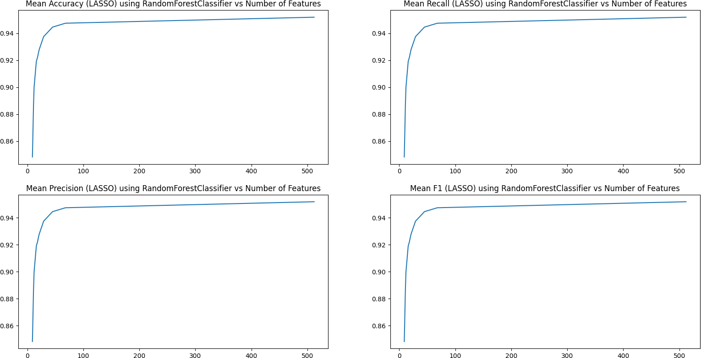

This image confirms the results from KNN and SVM, as the accuracy, recall, precision, and f1 scores are at 94% while number of features is above the 100, with a steep decline when they are bellow 100 features. 

### Confusion Matrix

#### K-Nearest-Neighbor

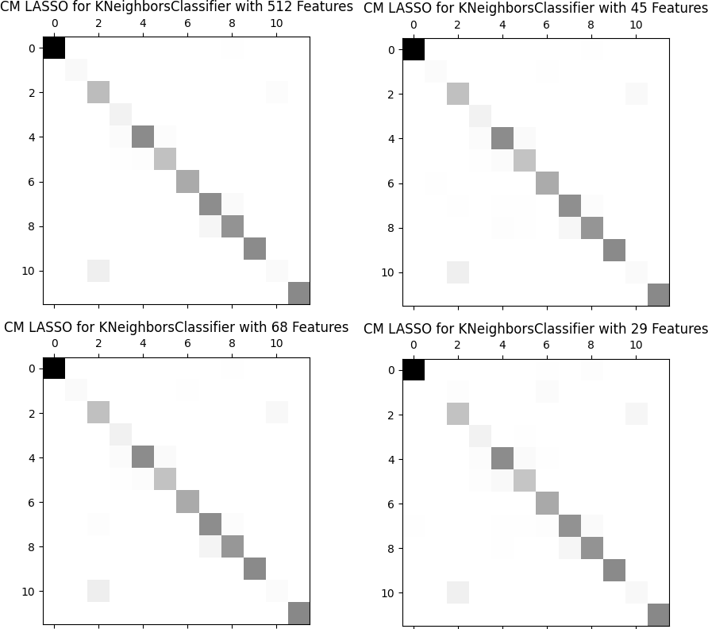 

In this image we can see that there is a clear diagonal line with very litle diviation in the class prediction. 

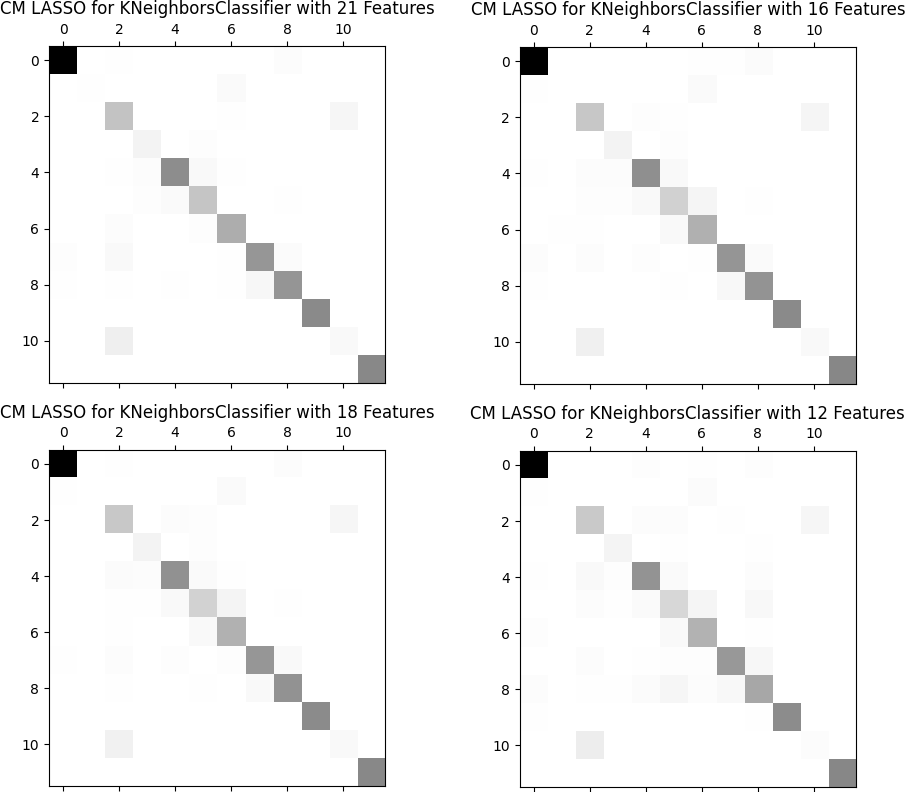 

As the number of features start to fall bellow 100, we can start to see that there are more diviations from the diagonal, indicating higher instances of misclassification in the prediction.  

 

Lastly, with very few number of features, we can see that the confusion matrix has an increased instance of diviation, in particular with 9 features, which shows very high veriation and mislassification.

#### Support Vector Machine

 

This image, just like in KNN, shows that the higher number of features have less divergance from the diagonal, this indicates that the accuracy and the TPR is higher overall, howver after 100 features, there are very similar results. 

This image has features between 21 and 12, this also a higher degree of divergance from the diagonal which indicates higher rates of misclassification. 

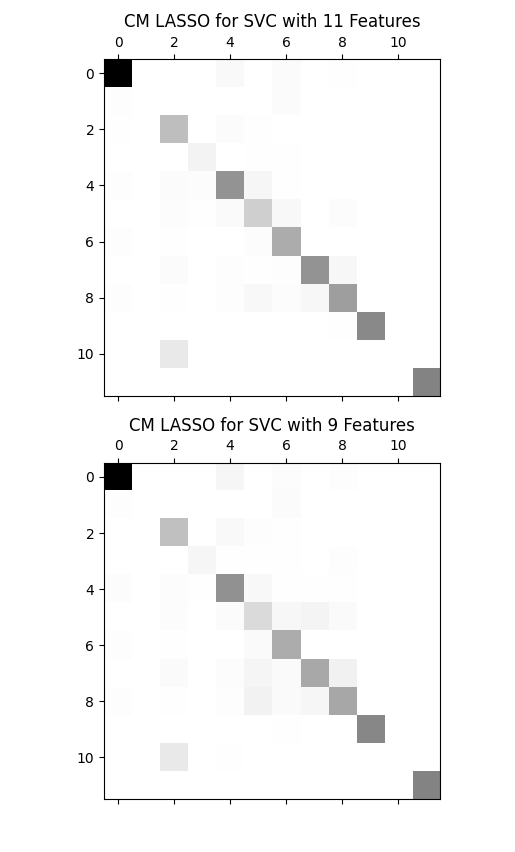 

This image shows the confusion matrix with 11 and 9 features, both showed a higher degree of divergance from the diagonal and higher instances of misclassification. 

#### Random Forest

 

The random forest further confirms the findings from KNN and SVM, which indicate that with highe number of features there are less indices of divergance from the diagonal, and thus lower rates the misclassification.   

  

THis image just in like KNN and SVM shows Lasso with less the 100 features, and thus has much higher divergance from the diagonal and higher instances of missclassification.  

 

### ROC Curves 

#### K-Nearest-Neighbor

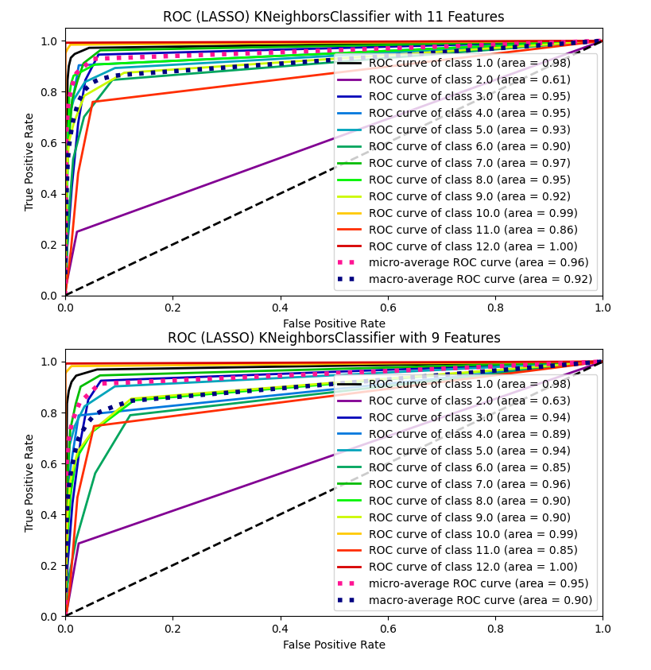

All this images show how the over TPR rapidly increases when the the number of features increases, but overall there was high rates of True positives with very low instances of False Positive Rate. 

#### Support Vector Machine 

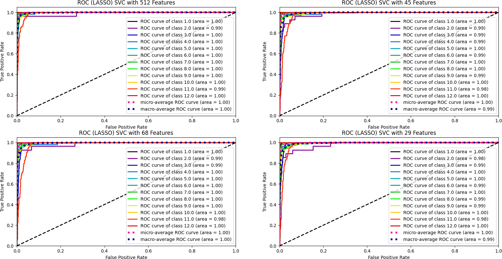

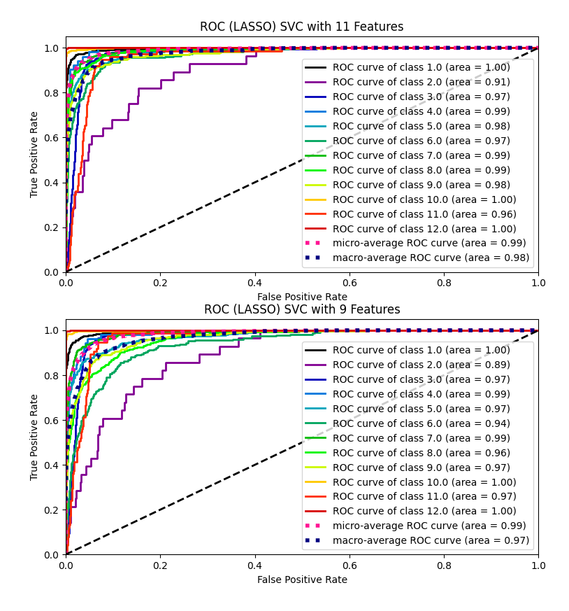

All this images show how the over TPR rapidly increases when the the number of features increases, but overall there was high rates of True positives with very low instances of False Positive Rate. 

#### Random Forest

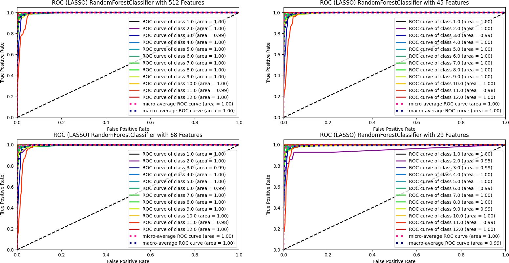

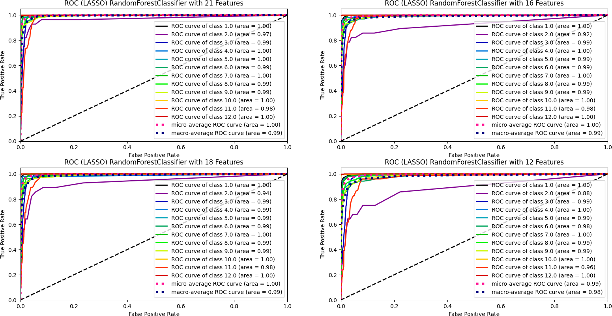

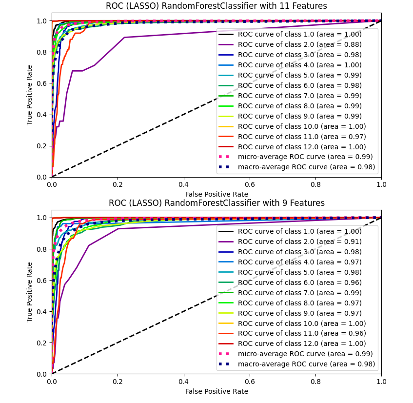

All this images show how the over TPR rapidly increases when the the number of features increases, but overall there was high rates of True positives with very low instances of False Positive Rate. 

## Recursive Feature Elimination (RFE)

### t-SNE

This figure is a really good example of how the clustering improves as the number of features increases. We can see a clear progression from iregular, choatic clustering to more organized grouped clusters. 

### Performance Metrics 

#### K-Nearest-Neighbor

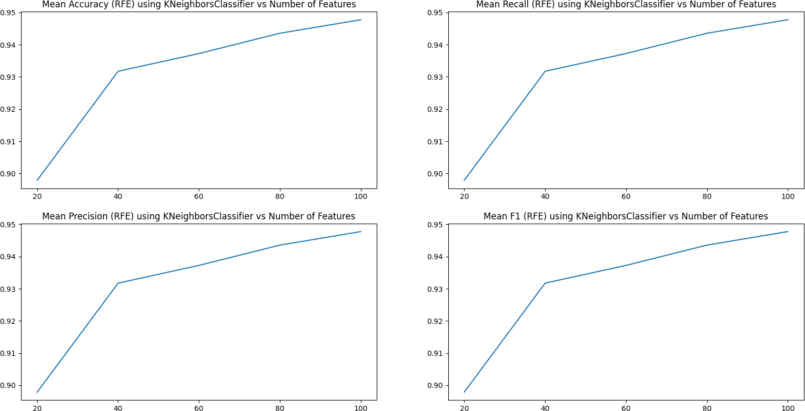

This figure shows that overall there is great increase in accuracy when the number of features increase, with maximum accuracy of 95% reached with 100 features, this result can be observed accross all metrics of accuracy, recall, precision, and f1. 

#### Support Vector Machine 

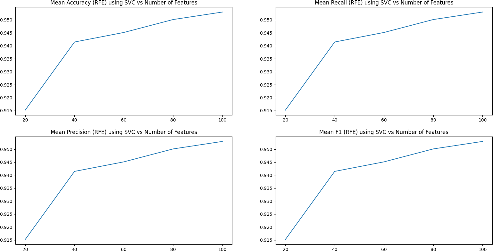

SVM results further validate the results obtained in KNN, as the mean accuracy, mean precision, mean recall, and mean f1 both increased in direct connection with the number of features selected from RFE. 

#### Random Forest

Random Forest as compared to KNN and SVM show a slightly diffrent image, with the accuracy, recall, precision and f1 both increasing with number of features, till around 60 features, where there is a slight decline, with another increase at 100 features. 

### Confusion Matrix 

#### K-Nearest-Neighbor

The confusion matrix with KNN shows as the number of features increase there is less divergance from the diagonal, indicating that the rates of missclassification are reduced as the number of features selected increase. 

#### Support Vector Machine 

SVM validates the results from KNN, where as the number of features selected increase, the overall diversion decre 

#### Random Forest

### ROC Curves 

#### K-Nearest-Neighbor

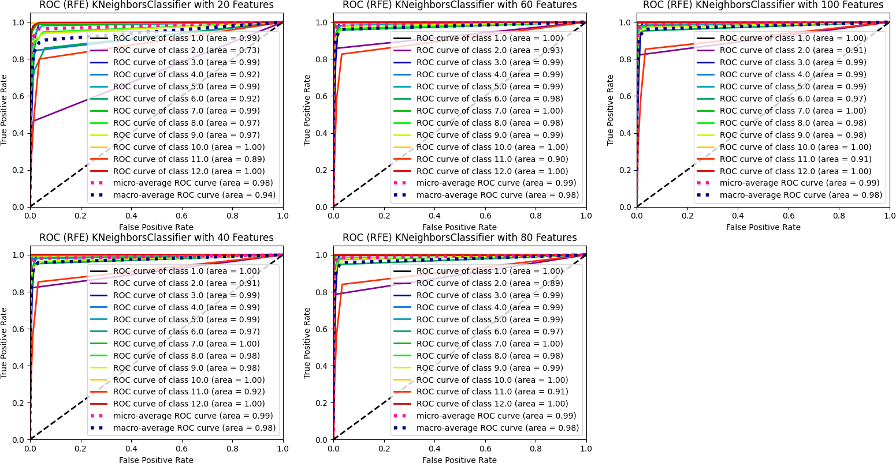

#### Support Vector Machine 

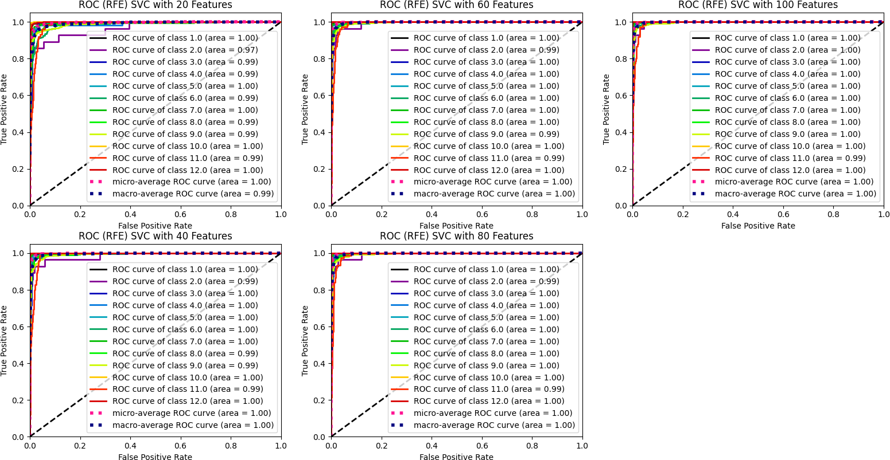

#### Random Forest

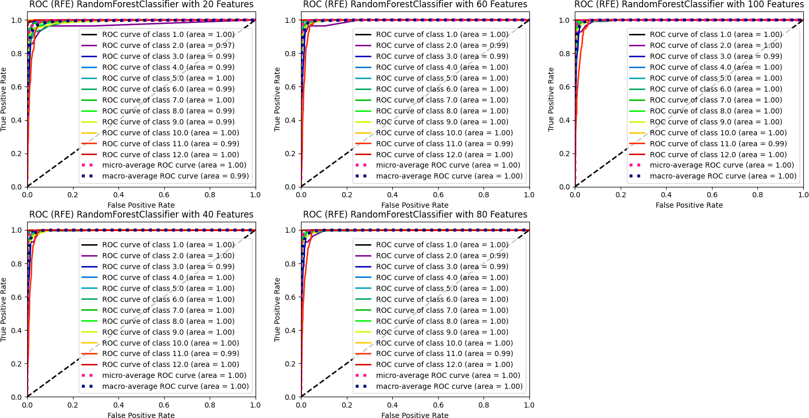

## SelectFromModel 

### t-SNE

### Performance Metrics 

#### K-Nearest-Neighbor

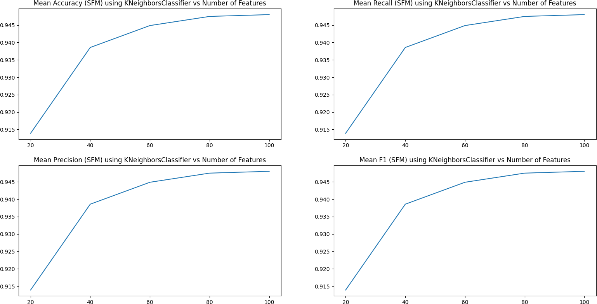

#### Support Vector Machine

#### Random Forest

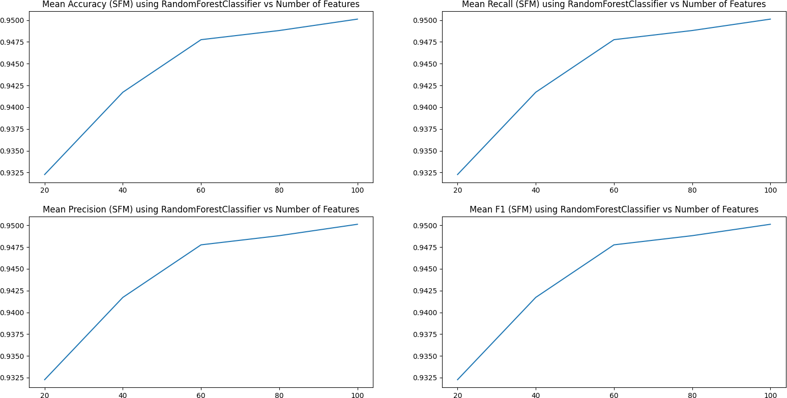

### Confusion Matrix 

#### K-Nearest Neighbor 

#### Support Vector Machine

#### Random Forest 

### ROC Curves 

#### K-Nearest Neighbor

#### Suppport Vector Machine 

#### Random Forest 

# Conclusion

# References	
- http://scikit-learn.org/stable/modules/generated/sklearn.feature_selection.SelectFromModel.html 
- https://www.analyticsvidhya.com/blog/2020/05/7-scikit-learn-hacks-tips-tricks/ 
- https://analyticsindiamag.com/guide-to-dimensionality-reduction-with-recursive-feature-elimination/ 
- https://www.titanwolf.org/Network/q/8f9189c7-fb76-4628-9707-822e8074ebfc/x 
- https://towardsdatascience.com/machine-learning-basics-with-the-k-nearest-neighbors-algorithm-6a6e71d01761
- https://learn.g2.com/k-nearest-neighbor
- https://www.kdnuggets.com/2020/04/introduction-k-nearest-neighbour-algorithm-using-examples.html
		
 

